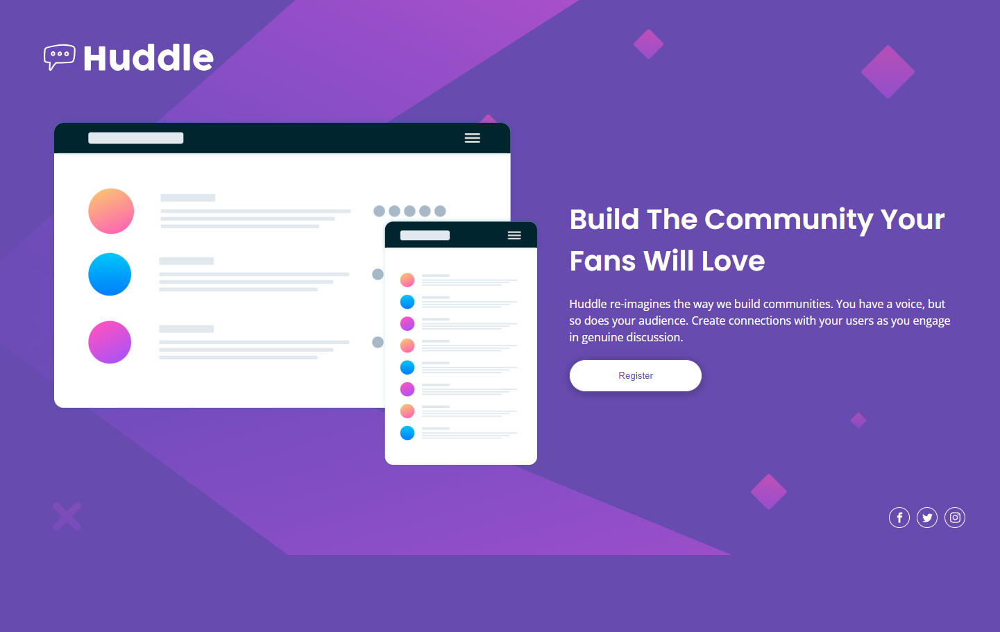

# Frontend Mentor - Huddle landing page with single introductory section solution

This is a solution to the [Huddle landing page with single introductory section challenge on Frontend Mentor](https://www.frontendmentor.io/challenges/huddle-landing-page-with-a-single-introductory-section-B_2Wvxgi0). Frontend Mentor challenges help you improve your coding skills by building realistic projects. 

## Table of contents

- [Overview](#overview)
  - [The challenge](#the-challenge)
  - [Screenshot](#screenshot)
  - [Links](#links)
- [My process](#my-process)
  - [Built with](#built-with)
  - [What I learned](#what-i-learned)
  - [Continued development](#continued-development)
- [Author](#author)

## Overview

### The challenge

Users should be able to:

- View the optimal layout for the page depending on their device's screen size
- See hover states for all interactive elements on the page

### Screenshot




### Links

- Solution URL: [Solution URL](https://github.com/YahiaG/Huddle-landing-page)
- Live Site URL: [Live Site URL](https://yahiag.github.io/Huddle-landing-page/)

## My process

### Built with

- Semantic HTML5 markup
- CSS custom properties
- Flexbox
- CSS Grid
- Mobile-first workflow

### What I learned

I learnt how to use SVG icons instead of web icons to save website loading time

```html
      <div class="social">
        <a href="#"><svg class="icon icon-facebook"><use xlink:href="#icon-facebook"></use></svg></a>
        <a href="#"><svg class="icon icon-twitter"><use xlink:href="#icon-twitter"></use></svg></a>
        <a href="#"><svg class="icon icon-instagram"><use xlink:href="#icon-instagram"></use></svg></a>
      </div>
```
```css
.social svg {
    width: 15px;
    fill: #FFF;
}
```


### Continued development

I need to learn more about SVG and master using it.

## Author

- Frontend Mentor - [@Yahia Ali](https://www.frontendmentor.io/profile/YahiaG)
- LinkedIn - [Yahia Ali](https://www.linkedin.com/in/Yahia-Ali22)

